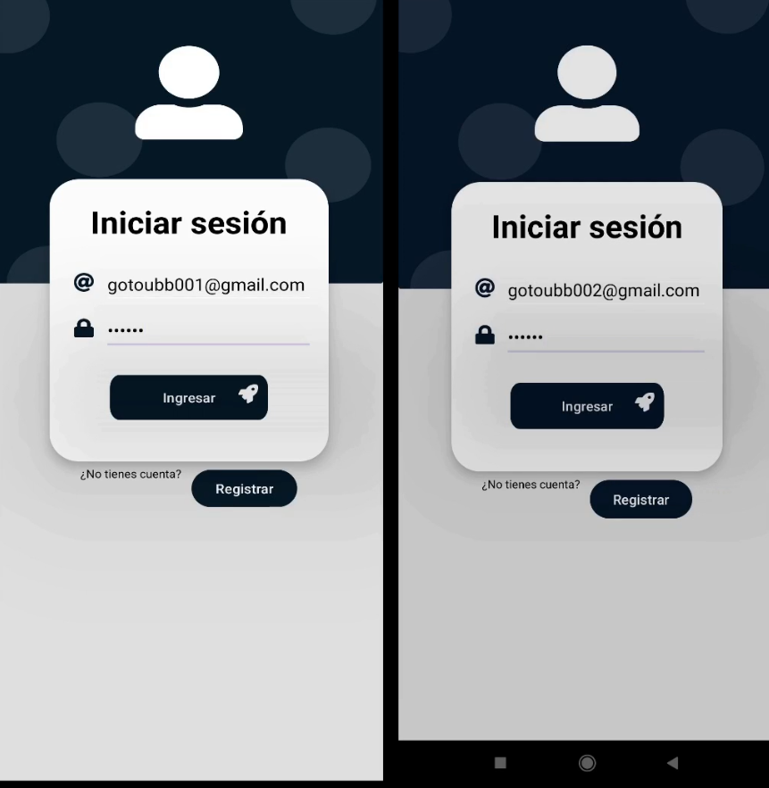
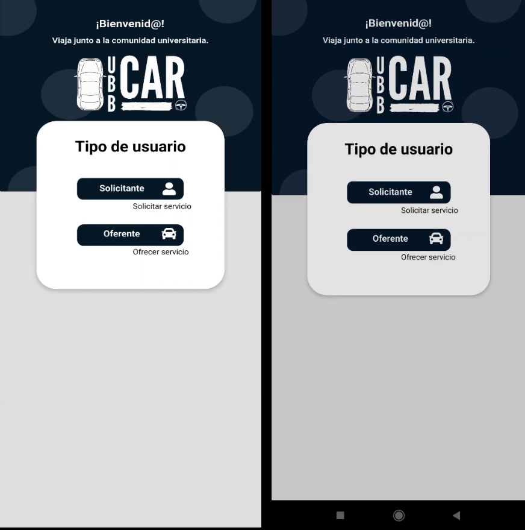
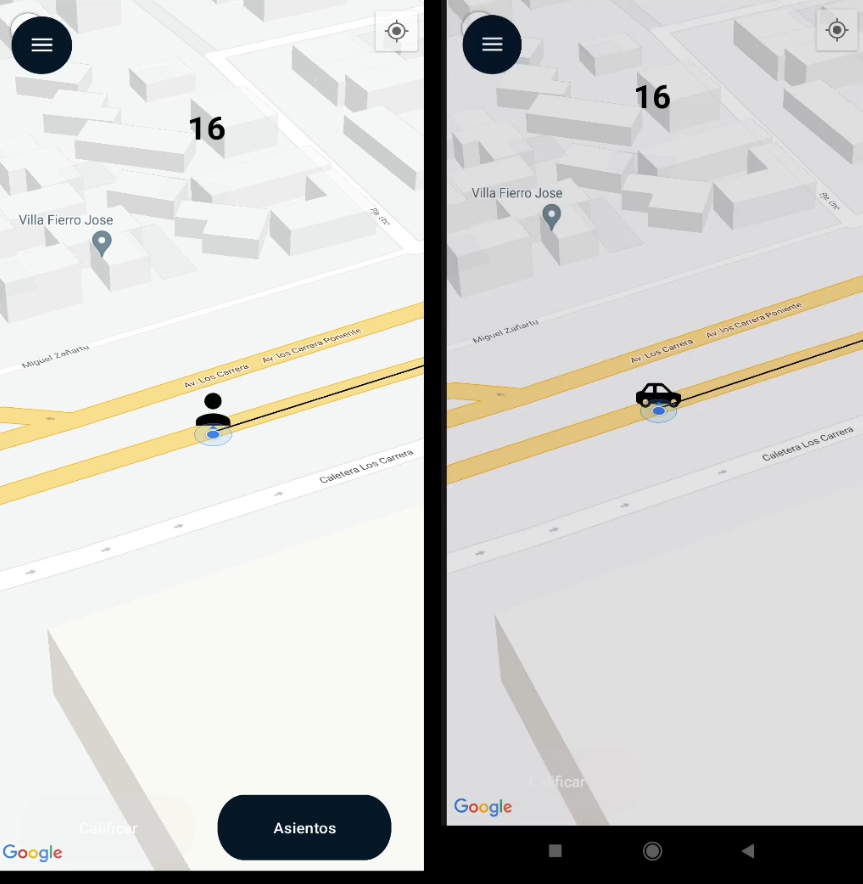
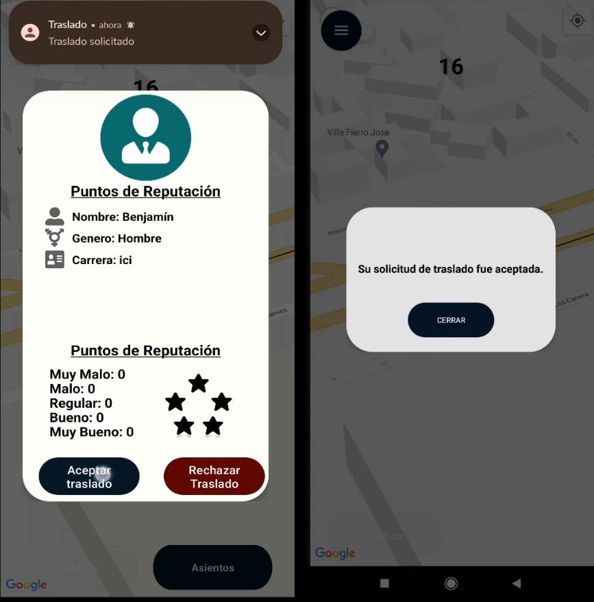
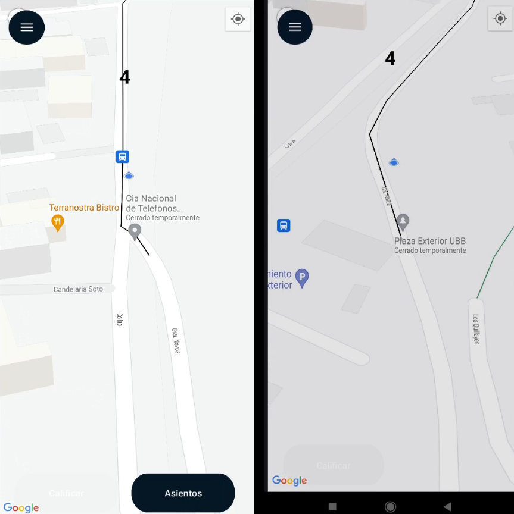
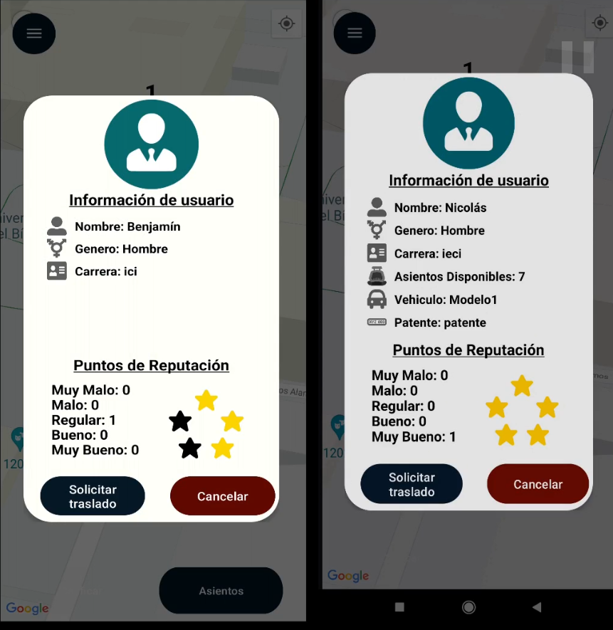
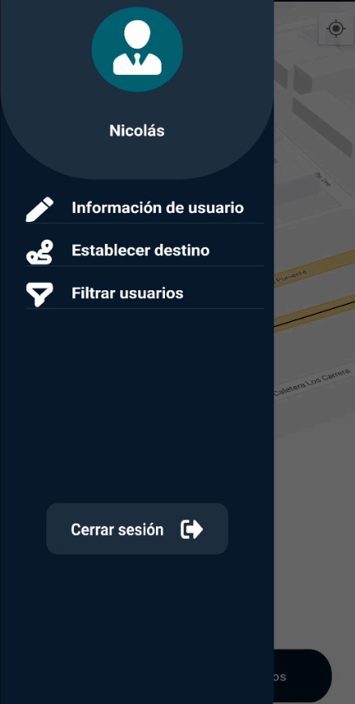
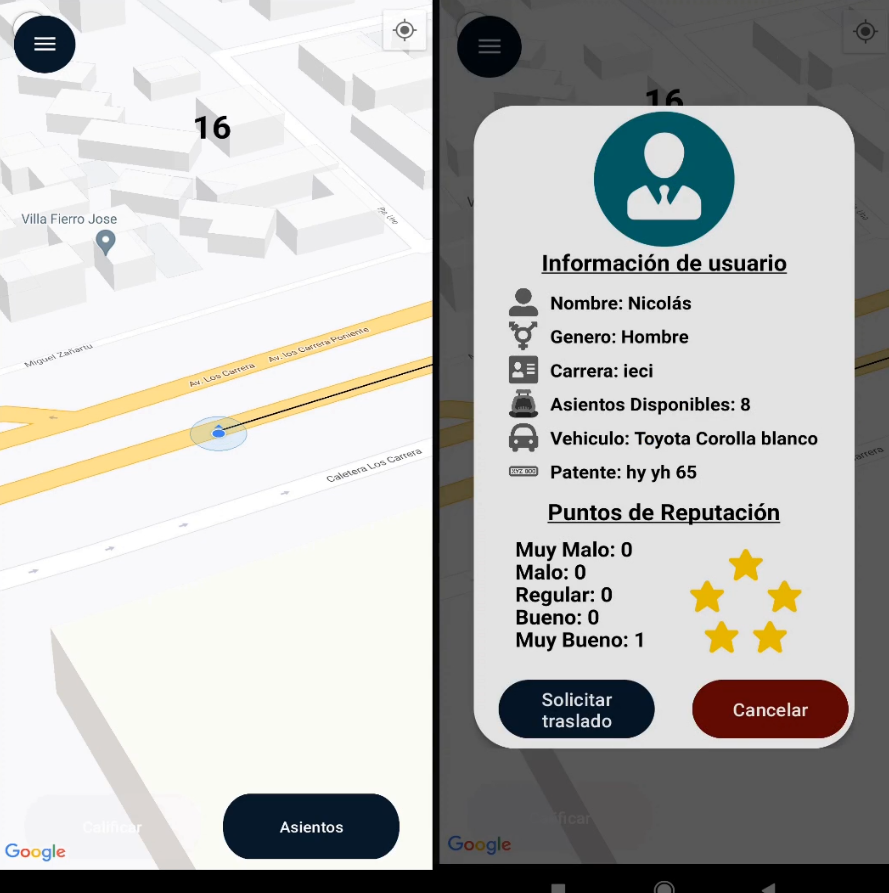
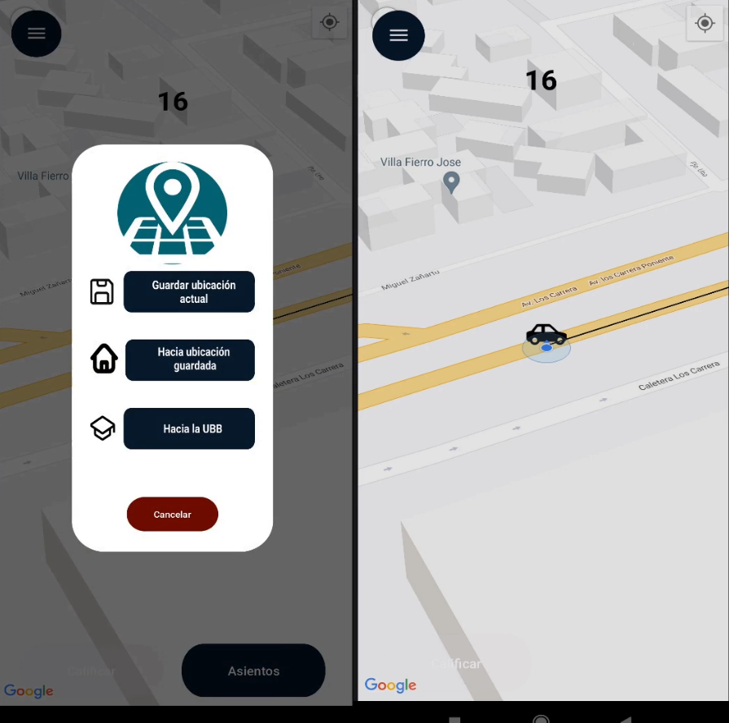
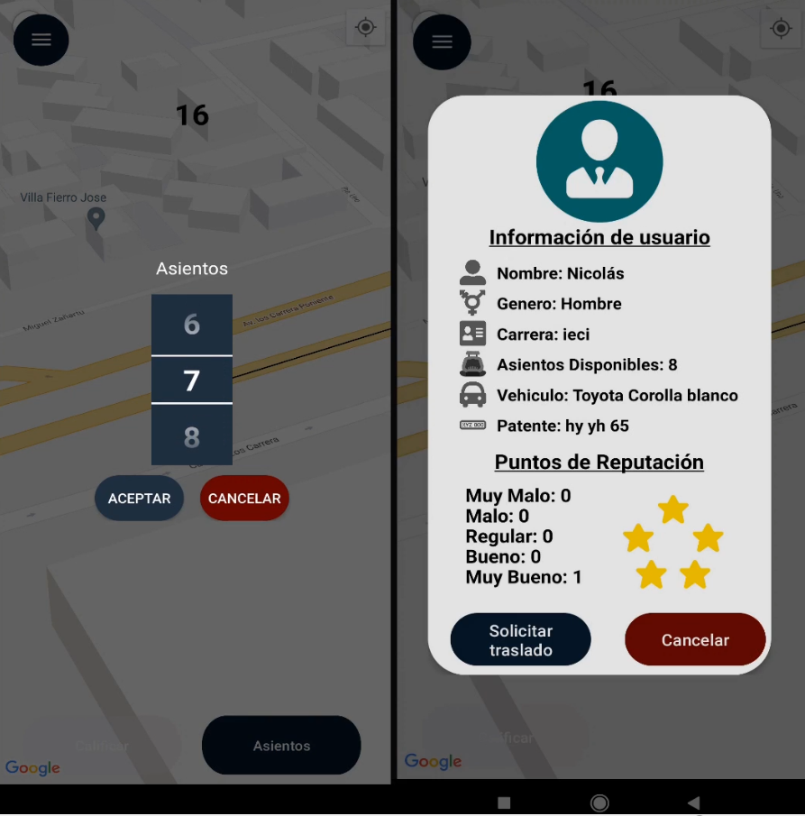

# App Móvil de Traslado para Usuarios UBB (Proyecto desarrollado como proyecto de título)

Aplicación móvil Android dirigida a usuarios de la Universidad del Bío-Bío, con el objetivo de facilitar la coordinación de traslados entre usuarios, se espera que su uso sea gratuito para todos los usuarios apelando a un sentido humanitario entre los miembros de la comunidad universitaria, a futuro se espera ortorgar algun tipo de retribucion para los miembros e incentivar su uso. 

## Secuencia de Acciones

### Considerando dos usuarios:

1. Los usuarios inician la aplicación, seleccionan su rol, e ingresan con su correo y contraseña.
2. Una vez dentro, la app solicitará el permiso de ubicación del dispositivo.
3. El usuario acepta el permiso de ubicación.
4. El usuario 1 visualiza en un mapa iconos correspondientes a otros usuarios, selecciona el icono correspondiente al usuario 2.
5. El usuario 1 selecciona "Solicitar traslado".
6. En el dispositivo del usuario 2, de forma automática se abre un Pop-Up en el cual se muestran las opciones aceptar traslado o cancelar.
7. El usuario 2 selecciona aceptar traslado.
8. Se repite el punto #6 y #7 ahora para el usuario 1.
9. Se ha realizado la coordinación entre usuarios, ahora está habilitado un botón "calificar".
10. El usuario selecciona el botón y entre las tres opciones ("Bueno", "Malo", "Default"), selecciona la más acorde al servicio recibido.
11. Aumenta en 1 el valor correspondiente al botón seleccionado para el usuario 2, afectando de este modo a su reputación (para esta versión solo el usuario que inició la secuencia puede calificar, actualmente en la app no se muestra información sobre reputación, actualmente solo se ve reflejada en la base de datos).

## La aplicacion actualmente también permite:

- Visualizar la ubicación de la UBB
- Establecer una ruta la cual se actualiza aproximadamente cada 10 segundos
- Establecer un margen de visibilidad para los usuarios (Desarrollada pero no implementada aún)
- Enviar una notificación en caso de que el dispositivo del usuario destino tenga la pantalla apagada
- Visualizar la identificación de cada usuario

## Software stack

- Kotlin
- Android Studio
- Firebase Realtime Database
- Firebase Cloud Messaging
- Firebase Authentication
- Volley 
- Google Maps API - Maps y Direction
- Gradle

## Imagenes

